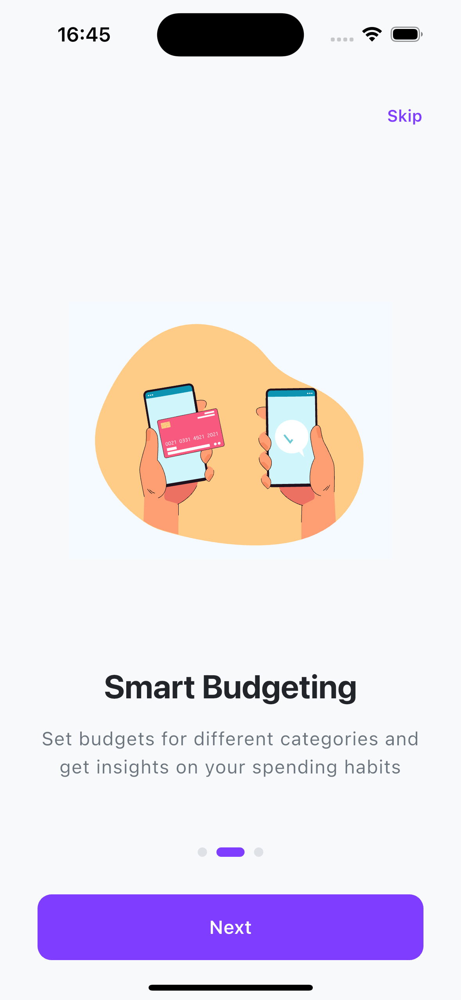
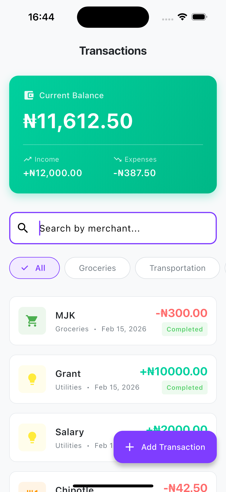
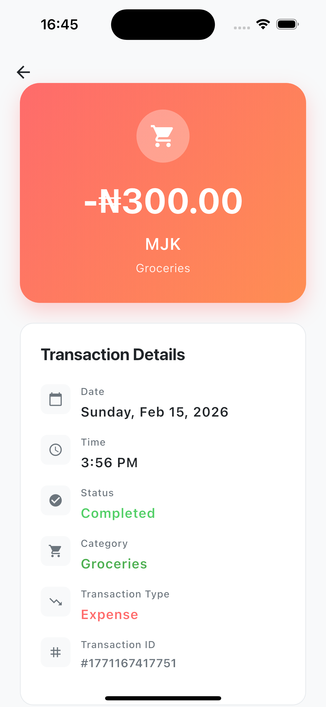
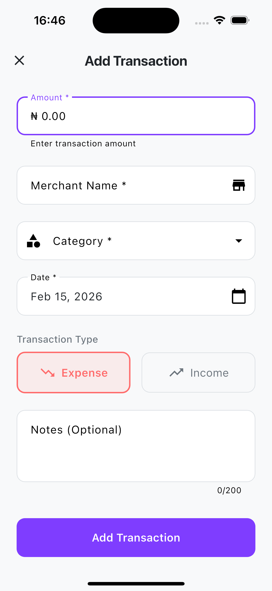

# 💰 Expense Tracker 

A modern, feature-rich expense tracking application built with Flutter, demonstrating clean architecture, state management, and professional UI/UX design.

---

## 📋 Table of Contents

- [Assessment Requirements](#-assessment-requirements)
- [Features](#-features)
- [Screenshots](#-screenshots)
- [Architecture](#-architecture)
- [Dependencies](#-dependencies)

---

## ✅ Assessment Requirements

### **Required Features - All Implemented**

#### **A. Transaction List Screen**
- ✅ Display list of transactions with merchant name, amount, category, and date
- ✅ Pull-to-refresh functionality
- ✅ Filter transactions by category
- ✅ Search transactions by merchant name
- ✅ Navigate to transaction detail screen
- ✅ Navigate to add transaction screen

#### **B. Transaction Detail Screen**
- ✅ Navigate from list to detail view
- ✅ Display full transaction information

#### **C. Add Transaction Screen**
- ✅ Form with validation for all fields
- ✅ Category picker
- ✅ Date picker
- ✅ Different keyboard types for different inputs
- ✅ Save transaction to local storage

### **Bonus Features Implemented** 🎉

Beyond the requirements, this app includes:
- ✅ **Balance Tracking** - Real-time balance calculation with income vs expenses
- ✅ **Low Balance Warnings** - Smart warnings when expense exceeds balance
- ✅ **Swipe to Delete** - Intuitive gesture-based deletion
- ✅ **Hero Animations** - Smooth transitions between screens
- ✅ **Onboarding Flow** - Beautiful first-time user experience
- ✅ **Data Persistence** - SharedPreferences with error handling and rollback
- ✅ **Negative Balance Handling** - Realistic financial tracking
- ✅ **Empty States** - Helpful messages when no data exists
- ✅ **Loading States** - Professional feedback during operations
- ✅ **Unsaved Changes Protection** - Prevents accidental data loss

---

## 🚀 Features

### **1. Balance Overview Card**
- Real-time balance calculation
- Income vs Expenses breakdown
- Warning indicator for negative balance

### **2. Transaction Management**
- **Add Transactions** - Full form with validation
- **View Details** - Complete transaction information
- **Delete Transactions** - Swipe left or use delete button
- **Filter by Category** - 7 categories with visual icons
- **Search by Merchant** - Real-time search

### **3. Smart UX Features**
- Keyboard type optimization (numeric for amount, text for merchant)
- Input formatters (auto-limit decimals)
- Confirmation dialogs (delete, unsaved changes)
- Low balance warnings
- Success/error feedback with retry options

### **4. Data Persistence**
- Local storage using SharedPreferences
- Automatic save/load
- Error handling with rollback on failure

### **5. Professional UI**
- Material Design 3
- Smooth animations (Hero, fade, slide,lottie)
- Color-coded categories
- Status indicators
- Empty states
- Loading indicators

---

## 📸 Screenshots

### **Onboarding Flow**
<table>
  <tr>
    <td></td>
    <td></td>
    <td></td>
    <td></td>
  </tr>
  <tr>
    <td align="center"><b>Splash Screen</b></td>
    <td align="center"><b>Welcome</b></td>
    <td align="center"><b>Features Overview</b></td>
  </tr>
</table>

### **Main Features**
<table>
  <tr>
    <td></td>
    <td></td>
    <td></td>
  </tr>
  <tr>
    <td align="center"><b>Transaction List with Balance Card</b></td>
    <td align="center"><b>Transaction Detail</b></td>
    <td align="center"><b>Add Transaction Form</b></td>
  </tr>
</table>

Architectural Principles

Separation of Concerns

Domain layer: Pure Dart entities (no Flutter dependencies)
Data layer: Repository pattern for data access
Presentation layer: UI and state management

State Management

Riverpod for reactive state
Provider pattern for dependency injection
StateNotifier for complex state

Navigation

GoRouter for declarative routing
Type-safe navigation
Deep linking support

🔧 Dependencies

dependencies:
flutter:
sdk: flutter

flutter_riverpod: ^3.2.1

# State Management
flutter_riverpod: ^3.2.1

# Navigation
go_router: ^17.1.0

# Local Storage
shared_preferences: ^2.5.4

# Utilities
intl: ^0.19.0              # Date formatting & number formatting

# UI/Animations
lottie: ^3.3.2

# Onboarding
smooth_page_indicator: ^2.0.1

dev_dependencies:
flutter_test:
sdk: flutter
flutter_lints: ^5.0.0
